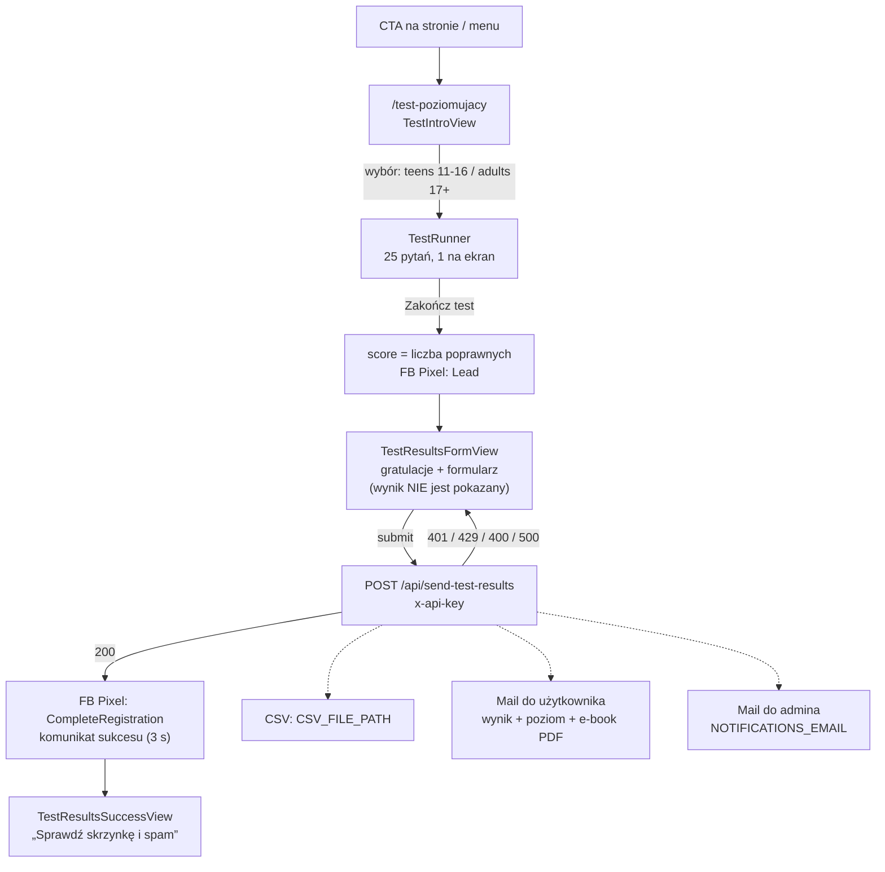

# Rozmowni.pl – przewodnik startowy

Dokument dla osób, które zaczynają pracę z tym repozytorium. Opisuje czym jest
projekt, jak jest zbudowany, jakie ma strony i jak działa najważniejszy proces
biznesowy: **test poziomujący**, który jest głównym źródłem leadów.

---

## 1. Czym jest projekt

**rozmowni.pl** to strona internetowa szkoły języka angielskiego online
(Kraków, prowadzona przez Małgorzatę Rudowską). Strona pełni dwie role:

1. **Wizytówka i oferta** – opis kursów, cennik, informacje o lektorach, kontakt.
2. **Lejek sprzedażowy (lead generation)** – bezpłatny test poziomujący, po którym
   użytkownik zostawia dane kontaktowe, dostaje wynik i e-book mailem, a szkoła
   dostaje powiadomienie i umawia bezpłatną lekcję próbną.

Cała strona jest po polsku. Prawie każde CTA na stronie głównej prowadzi do
testu poziomującego.

---

## 2. Stack technologiczny

| Obszar      | Technologia                                                                                                       |
| ----------- | ----------------------------------------------------------------------------------------------------------------- |
| Framework   | **Next.js 15** (Pages Router, `src/pages`), React 19                                                              |
| Stylowanie  | Bootstrap 5 (SCSS), CSS Modules (`*.module.scss`), globalne CSS, FontAwesome, ikony `bicon`                       |
| Formularze  | `react-hook-form`                                                                                                 |
| Maile       | `@react-email/components` + `@react-email/render` (szablony JSX), `nodemailer` (SMTP)                             |
| Antyspam    | Google reCAPTCHA v3 (formularz kontaktowy), klucz API + rate limiting (API routes)                                |
| Analityka   | Google Analytics 4 (`react-ga4`), Facebook Pixel (`react-facebook-pixel`) – szczegóły: [tracking.md](tracking.md) |
| Inne        | `react-cookie-consent`, `react-multi-carousel` (opinie)                                                           |
| Jakość kodu | ESLint 9 (flat config), Prettier, Husky + lint-staged, commitlint                                                 |
| Release     | brak – deploy ręcznie z GitHub Actions, historia wersji w git logu                                                |
| Node (CI)   | 22.18.0                                                                                                           |

**Brak testów automatycznych** – `npm test` wypisuje tylko `No tests`.

---

## 3. Struktura katalogów

```
.
├── app.js                      # opcjonalny custom server (http + next), port 3000
├── next.config.js              # rozmiary obrazków, includePaths dla SASS
├── .env.example                # szablon zmiennych środowiskowych
├── .github/workflows/          # CI: lint+test, CodeQL, deploy staging/production
├── docs/                       # dokumentacja: start.md (ten plik), tracking.md, todo.md
├── public/                     # statyki: obrazki, fonty, sitemap.xml, robots.txt,
│                               # .htaccess i mail.php (pozostałości po starym hostingu PHP)
├── test.md                     # STARY draft pytań testu – NIE jest źródłem danych (patrz 6.8)
└── src/
    ├── pages/                  # routing Next.js (Pages Router)
    │   ├── _app.js             # wspólny layout: Header, Footer, CookieConsent, Metadata, tracking
    │   ├── _document.js
    │   ├── index.js            # strona główna
    │   ├── test-poziomujacy.js # test poziomujący (maszyna stanów)
    │   ├── email-preview.js    # podgląd i testowa wysyłka maili (basic auth)
    │   ├── 404.js
    │   ├── api/                # API routes (wysyłka maili)
    │   ├── cennik/ kontakt/ o-nas/ polityka-prywatnosci/ kursy/
    ├── components/             # komponenty UI; components/test/ – ekrany testu
    ├── data/testData.js        # pytania, odpowiedzi i progi poziomów testu
    ├── emails/                 # szablony maili (React Email)
    ├── hooks/                  # useClickTracking, usePageViewTracking, useFacebook*
    ├── routes/index.js         # jedyne źródło prawdy o ścieżkach URL (routeMap)
    ├── services/
    │   ├── metadata/           # SEO: title, description, OpenGraph, JSON-LD per strona
    │   └── tracking/           # GA4 + FB Pixel + definicje eventów (patrz tracking.md)
    ├── styles/                 # SCSS/CSS globalne
    └── utils/                  # apiAuth.js, emailService.js, drobne helpery
```

---

## 4. Uruchomienie lokalne

```bash
npm ci
cp .env.example .env.local     # uzupełnij wartości (patrz sekcja 9)
npm run dev                    # http://localhost:3000
```

Inne skrypty:

| Skrypt                              | Co robi                                   |
| ----------------------------------- | ----------------------------------------- |
| `npm run build`                     | build produkcyjny                         |
| `npm start`                         | serwer produkcyjny (po buildzie)          |
| `node app.js`                       | alternatywny custom server na porcie 3000 |
| `npm run lint` / `lint:fix`         | ESLint, zero ostrzeżeń dozwolonych        |
| `npm run prettier` / `prettier:fix` | sprawdzenie / formatowanie                |

Uwagi:

- W trybie `development` GA i FB Pixel **nie wysyłają** nic na zewnątrz, tylko
  logują do konsoli (`GA: ...`, `FB: ...`). To jedyny sposób weryfikacji
  trackingu lokalnie – patrz [tracking.md](tracking.md#23-tryb-deweloperski).
- Wysyłka maili wymaga poprawnej konfiguracji SMTP w `.env.local`. Bez niej
  API zwróci 500 z komunikatem o brakującej konfiguracji.
- Frontend wysyła nagłówek `x-api-key` z wartości `NEXT_PUBLIC_API_KEY`; serwer
  porównuje go z `API_KEY`. Lokalnie ustaw obie zmienne na tę samą wartość.

---

## 5. Strony

Ścieżki są zdefiniowane w jednym miejscu: `src/routes/index.js` (`routeMap`).
Komponenty nigdy nie wpisują URL-i ręcznie, tylko `routeMap[routeNames.X]`.
Metadane SEO dla każdej trasy są w `src/services/metadata/getMetadata.js`.

### 5.1 Strony publiczne

| URL                                 | Plik                                        | Opis                                                                                                                                                                                                                         | Menu                 | Sitemap             |
| ----------------------------------- | ------------------------------------------- | ---------------------------------------------------------------------------------------------------------------------------------------------------------------------------------------------------------------------------- | -------------------- | ------------------- |
| `/`                                 | `pages/index.js`                            | Strona główna – lejek do testu (patrz 5.3)                                                                                                                                                                                   | logo                 | tak                 |
| `/test-poziomujacy`                 | `pages/test-poziomujacy.js`                 | Test poziomujący (intro → pytania → formularz → sukces)                                                                                                                                                                      | tak (wyróżnione CTA) | tak                 |
| `/kursy/indywidualne`               | `pages/kursy/indywidualne.js`               | Lekcje 1:1, 120 zł / 45 min, typy: konwersacje, General/Business English, egzaminy                                                                                                                                           | tak                  | tak                 |
| `/kursy/grupowe`                    | `pages/kursy/grupowe.js`                    | Grupy 2–3 os., 1650 zł/semestr, 30 lekcji, poziomy A2–C2                                                                                                                                                                     | tak                  | tak                 |
| `/kursy/egzamin-8-klasisty`         | `pages/kursy/egzamin-8-klasisty.js`         | Grupy 3–4 os., 1430 zł/semestr, 26 lekcji                                                                                                                                                                                    | tak                  | tak                 |
| `/kursy/egzamin-maturalny`          | `pages/kursy/egzamin-maturalny.js`          | Grupy 3–4 os., 1430 zł/semestr, poziom podst./rozsz.                                                                                                                                                                         | tak                  | tak                 |
| `/cennik`                           | `pages/cennik/index.js`                     | Akordeony z cenami wszystkich kursów + dane do przelewu                                                                                                                                                                      | tak                  | tak                 |
| `/o-nas`                            | `pages/o-nas/index.js`                      | Sylwetki lektorów (Gosia, Denis, Angelika, Ania, Georgia, Wiktor, Weronika) + opinie                                                                                                                                         | tak                  | tak                 |
| `/kontakt`                          | `pages/kontakt/index.js`                    | Dane kontaktowe, social media, formularz kontaktowy (reCAPTCHA v3)                                                                                                                                                           | tak                  | tak                 |
| `/polityka-prywatnosci`             | `pages/polityka-prywatnosci/index.js`       | Polityka prywatności, `robots: noindex, follow`                                                                                                                                                                              | stopka               | nie                 |
| `/kursy/intensywne-kursy-wakacyjne` | `pages/kursy/intensywne-kursy-wakacyjne.js` | **Wyłączona.** Wpis w `routeMap` jest zakomentowany, więc `getServerSideProps` zwraca `notFound` (404). Linki w menu, stopce i cenniku renderują się warunkowo. Aby włączyć, odkomentuj wpis w `routeMap` i w `sitemap.xml`. | nie                  | nie (zakomentowana) |

Strony kursów używają wspólnych klocków: `CourseLayout`, `CourseHeader`,
`CourseSidebar` (cena + szczegóły + przycisk „Zapisz się” → `/kontakt`),
`CourseInfo`, `CourseRequirements`, `CourseDetails`.

### 5.2 Strony techniczne

| URL                                        | Opis                                                                                                                                                                                                                 |
| ------------------------------------------ | -------------------------------------------------------------------------------------------------------------------------------------------------------------------------------------------------------------------- |
| `/email-preview`                           | Podgląd 3 szablonów maili z danymi testowymi i przyciski do wysyłki testowej. Chronione **HTTP Basic Auth** w `src/middleware.js` (`BASIC_AUTH_USER`/`BASIC_AUTH_PASS`; `BASIC_AUTH_ENABLED=false` wyłącza ochronę). |
| `/404`                                     | Własna strona 404 z obrazkiem.                                                                                                                                                                                       |
| `POST /api/send-test-results`              | Zapis wyniku do CSV + wysyłka maili po teście (patrz 6.5).                                                                                                                                                           |
| `POST /api/send-contact-form-notification` | Powiadomienie mailowe z formularza kontaktowego (patrz 7).                                                                                                                                                           |

### 5.3 Strona główna – kolejność sekcji

Wszystkie CTA (poza „Dowiedz się więcej” i kilkoma linkami do kontaktu)
prowadzą do `/test-poziomujacy` i mają osobny event GA, więc widać, która
sekcja konwertuje. Mapa „sekcja → event” jest w
[tracking.md](tracking.md#43-lejek-na-stronie-głównej).

1. `Banner` – hero „Mów swobodnie po angielsku”, CTA test + „Zobacz, jak uczymy”
2. `Features` – 4 kafelki: konwersacje, ciekawe zajęcia, online, szybkie efekty
3. `SocialProofStats` – 100+ uczniów, 95% poleca, 15+ lat, 10 min test; CTA test
4. `WhyUsExpanded` – „Poznajmy się”, rozwijana sekcja; CTA test (na dole sekcji)
5. `Conversations` – jak uczymy, tematy konwersacji
6. `Idea` – filozofia nauki
7. `TestBenefits` – co zyskujesz robiąc test (wynik, lekcja próbna, plan, e-book); CTA test. Oferta „pakietu startowego” jest opisana **tylko tutaj** – `FinalCTA` jej nie powtarza
8. `Opinions` – karuzela opinii uczniów
9. `TestFAQ` – 8 pytań w akordeonie (czas, cena, kiedy wynik, spam, poziomy, zobowiązania, powtórka, niski poziom); CTA test + kontakt
10. `FinalCTA` – końcowe wezwanie do testu (nagłówek, zdanie, przycisk, linijka zapewnienia). Zastępuje na stronie głównej pasek `footer-cta`, który `Footer` ukrywa tu i na stronie testu

### 5.4 Wspólny layout (`_app.js`)

Każda strona jest owinięta w: `Metadata` (title/description/OG/JSON-LD z
`getMetadata`), `Header` (menu desktop + mobile), treść strony, `Footer`
(linki, social media, telefon, e-mail), `CookieConsent` (baner na dole,
cookie `cookieConsent` na 90 dni). Hooki `usePageViewTracking` (GA4) i
`useFacebookTracking` (FB Pixel PageView) odpalają się przy każdej zmianie
`router.pathname` – zmiana samego query stringa **nie** wysyła page view
([tracking.md](tracking.md#33-konsekwencje-użycia-routerpathname)).

Baner cookies jest wyłącznie informacyjny – **nie blokuje** GA ani Pixela,
które strzelają przed jakąkolwiek zgodą
([tracking.md](tracking.md#6-zgoda-na-cookies)).

---

## 6. Flow testu poziomującego

To najważniejsza funkcja biznesowa. Pliki:

| Warstwa     | Plik                                                                                                                                                      |
| ----------- | --------------------------------------------------------------------------------------------------------------------------------------------------------- |
| Strona/stan | `src/pages/test-poziomujacy.js`                                                                                                                           |
| Ekran 1     | `src/components/test/TestIntroView.js`                                                                                                                    |
| Ekran 2     | `src/components/test/TestRunner.js`                                                                                                                       |
| Ekran 3 i 4 | `src/components/test/TestResultsView.js`                                                                                                                  |
| Dane        | `src/data/testData.js` (`testData`, `getLevel`)                                                                                                           |
| API         | `src/pages/api/send-test-results.js`                                                                                                                      |
| Maile       | `src/emails/TestResultsEmail.jsx`, `src/emails/TestResultsNotificationEmail.jsx`, `src/utils/emailService.js`                                             |
| Tracking    | `src/services/tracking/facebookEvents.js`, `src/services/tracking/events.js` – patrz [tracking.md](tracking.md#5-eventy-facebook-pixel-konwersje-z-testu) |

### 6.1 Diagram



### 6.2 Wejścia do testu

- Menu (desktop i mobile): pozycja „Test poziomujący” z klasą `test-cta`.
- Strona główna: `Banner`, `SocialProofStats`, `WhyUsExpanded`,
  `TestBenefits`, `TestFAQ`, `FinalCTA`.
- `/kursy/indywidualne`: komponent `NewSemesterSignUp` (eksportuje `WhyUs`) linkuje do testu.
- Każde kliknięcie ma własny event GA (`HOME_*_CLICK_TEST`, `NAVIGATION_CLICK_MENU_ITEM`)
  – pełna lista w [tracking.md](tracking.md#43-lejek-na-stronie-głównej).

### 6.3 Stan strony (`test-poziomujacy.js`)

Prosta maszyna stanów na trzech zmiennych:

| Stan           | Wartość                                       | Renderowany ekran       |
| -------------- | --------------------------------------------- | ----------------------- |
| `selectedTest` | `null`                                        | `TestIntroView`         |
| `selectedTest` | `'adults'` lub `'teens'`, `showResults=false` | `TestRunner`            |
| `showResults`  | `true`                                        | `TestResultsView`       |
| `score`        | liczba poprawnych odpowiedzi                  | przekazywany do wyników |

Wejście na `/test-poziomujacy` bez query stringu resetuje stan do intro
(`useEffect` na `router.asPath`). Każde przejście robi `window.scrollTo(0, 0)`.
Stan jest tylko w pamięci – odświeżenie strony zaczyna test od nowa.

### 6.4 Ekrany

**Ekran 1 – `TestIntroView`.** Landing z korzyściami (10 minut, wynik od razu,
A1–C2, darmowy; po teście: poziom, zaproszenie na lekcję próbną, e-book
„Czas na angielski”). Na dole dwa kafelki wyboru:
„Test dla młodzieży” (11–16 lat, `teens`) i „Test dla dorosłych” (17+, `adults`).
Oba mają 25 pytań.

**Ekran 2 – `TestRunner`.**

- Jedno pytanie na ekran, odpowiedzi jako klikane kafelki `a) b) c) (d)`.
- Test dla dorosłych ma 4 opcje, dla młodzieży 3.
- Przycisk „Następne” jest nieaktywny, dopóki nie wybrano odpowiedzi.
- „Poprzednie” cofa i przywraca wcześniej wybraną odpowiedź (odpowiedzi trzymane
  w tablicy `answers[indeksPytania]`).
- Pasek postępu liczy **udzielone odpowiedzi**, nie numer pytania.
- Na ostatnim pytaniu przycisk zmienia się na „Zakończ test”. Wynik to liczba
  pozycji, gdzie `answers[i] === questions[i].correct`. Wywołuje `onTestComplete(score)`.

**Przejście do wyników.** W `handleTestComplete` strona zapisuje `score`,
ustawia `showResults=true` i wysyła do FB Pixel event **`Lead`**
(`TEST_COMPLETED_LEAD(selectedTest)`, `content_name: 'Test poziomujący'`,
`content_category: 'adults'|'teens'`). Event odpala się raz na ukończony test.

**Ekran 3 – `TestResultsFormView`.** Celowo **nie pokazuje wyniku ani poziomu**
na stronie. Użytkownik widzi:

- „Gratulacje! Test ukończony!” + social proof (100+ osób),
- co dostanie mailem (szczegółowy wynik, e-book 12 stron),
- **formularz** (react-hook-form):

  | Pole                | Wymagane                                  | Walidacja             |
  | ------------------- | ----------------------------------------- | --------------------- |
  | Imię i nazwisko     | tak                                       |                       |
  | Email               | tak                                       | `/^\S+@\S+$/i`        |
  | Numer telefonu      | tylko gdy „Preferowany kontakt” = Telefon | `/^[+]?[\d\s\-()]+$/` |
  | Preferowany kontakt | tak (radio: Telefon / Email)              |                       |

- korzyści z lekcji próbnej i social proof „90% uczniów poleca”.

Poziom liczony jest po stronie klienta: `getLevel(score, selectedTest)` zwraca
obiekt `{ level, title, description }`; do API idzie `testLevel` jako
`"B2 - Poziom średniozaawansowany wyższy"` i `testScore` jako `"18/25"`.

**Submit:**

1. `isSubmitting=true`, przycisk „Wysyłanie...”.
2. `POST /api/send-test-results` z nagłówkami z `createAuthHeaders()`
   (`Content-Type: application/json`, `x-api-key`).
3. Gdy `!response.ok` → wyjątek → komunikat błędu „Wystąpił błąd podczas
   wysyłania. Spróbuj ponownie.”; formularz zostaje, można wysłać ponownie.
4. Gdy OK → `isSubmitted=true` (przycisk zablokowany na stałe), FB Pixel
   **`CompleteRegistration`** (`TEST_CONTACT_DETAILS_SUBMITTED(selectedTest)`),
   sztuczne opóźnienie 1 s, komunikat „Formularz został wysłany pomyślnie!”,
   po 3 s przejście do ekranu 4 i reset formularza.

**Ekran 4 – `TestResultsSuccessView`.** „Dziękujemy!” – wynik i e-book poszły
mailem, sprawdź skrzynkę i spam, wkrótce kontakt w wybranej formie.

### 6.5 Backend: `POST /api/send-test-results`

Kolejność sprawdzeń i kody odpowiedzi:

| Krok          | Warunek                                                                                                                   | Odpowiedź                         |
| ------------- | ------------------------------------------------------------------------------------------------------------------------- | --------------------------------- |
| Metoda        | inna niż POST                                                                                                             | 405                               |
| Autoryzacja   | `x-api-key !== process.env.API_KEY` (lub brak `API_KEY`)                                                                  | 401                               |
| Rate limit    | > 5 żądań / 60 s z jednego IP (`x-forwarded-for` lub remoteAddress), pamięć procesu                                       | 429                               |
| Walidacja     | brak `fullName`, `email`, `testScore`, `testLevel`, `testType`, `totalQuestions`                                          | 400                               |
| Walidacja     | zły format email                                                                                                          | 400                               |
| Zapis CSV     | dopisanie wiersza do `CSV_FILE_PATH` (domyślnie `./test-results.csv`); błąd zapisu jest tylko logowany, nie przerywa flow | –                                 |
| Wysyłka maili | patrz niżej; błąd SMTP                                                                                                    | 500 z `details` i `code`          |
| Sukces        |                                                                                                                           | 200 `{ success, message, debug }` |

Kolumny CSV: `timestamp, fullName, email, phone, contactMethod, testScore,
testLevel, testType, totalQuestions`. Na produkcji plik to
`/home/rozmowni/rails/prod-test-results.csv`, na stagingu `stage-test-results.csv`.

Parametr query `emailType` steruje wysyłką (używany przez `/email-preview`):

| `emailType`         | Do użytkownika (`TestResultsEmail`) | Do admina (`TestResultsNotificationEmail`) |
| ------------------- | ----------------------------------- | ------------------------------------------ |
| brak (domyślnie)    | tak                                 | tak                                        |
| `results-only`      | tak                                 | nie                                        |
| `notification-only` | nie                                 | tak                                        |

**Mail do użytkownika** (`from: SMTP_FROM`, temat „Twój wynik testu + darmowy
e-book "Czas na angielski"”): powitanie, wynik i poziom, opis poziomu
(dopasowany po `testLevel.includes('B2')` itd.), social proof, opinie, korzyści,
przycisk do e-booka `https://rozmowni.pl/shared/czasy_ebook_(rozmowni.pl).pdf`,
FAQ, „Co dalej?” (lekcja próbna).

**Mail do admina** (`to: NOTIFICATIONS_EMAIL`, temat „Rozmowni.pl - Nowy
użytkownik ukończył test - [Imię]”): dane użytkownika, telefon jako link `tel:`,
preferowany kontakt, typ testu, wynik z procentem, poziom, analiza, następne
kroki, szybkie akcje.

### 6.6 Skala poziomów

Progi są **identyczne** dla obu testów (25 pytań), różnią się tylko nazwy:

| Punkty | Poziom | Tytuł (adults)                    | Tytuł (teens)      |
| ------ | ------ | --------------------------------- | ------------------ |
| 0–7    | A1     | Poziom podstawowy                 | Beginner           |
| 8–12   | A2     | Poziom elementarny                | Elementary         |
| 13–17  | B1     | Poziom średniozaawansowany        | Pre-Intermediate   |
| 18–21  | B2     | Poziom średniozaawansowany wyższy | Intermediate       |
| 22–24  | C1     | Poziom zaawansowany               | Upper-Intermediate |
| 25     | C2     | Poziom biegły                     | Advanced           |

### 6.7 Struktura danych (`src/data/testData.js`)

```js
export const testData = {
  adults: {
    title: 'Test dla dorosłych',
    questions: [{ id: 1, question: '...', options: ['a', 'b', 'c', 'd'], correct: 0 }, ...],
    levels: [{ min: 0, max: 7, level: 'A1', title: '...', description: '...' }, ...],
  },
  teens: { /* jak wyżej, 3 opcje na pytanie */ },
};
export const getLevel = (score, testType) => /* levels.find(min <= score <= max) */;
```

`correct` to **indeks** w `options` (0-based). Dodając pytanie, zaktualizuj
też progi `levels`, bo są oparte na liczbie punktów, nie na procentach.

### 6.8 Uwagi i pułapki

- `test.md` w katalogu głównym to stary draft (inne pytania, 22 pytania w
  wersji ogólnej). **Źródłem prawdy jest `src/data/testData.js`.**
- Dane testowe w `/email-preview` dla `teens` mają `15/22` i 22 pytania – to
  tylko dane podglądowe, niezgodne z realnym testem.
- Rate limiter trzyma liczniki w pamięci procesu: resetuje się przy restarcie
  i nie jest współdzielony między instancjami.
- Wynik nie jest pokazywany w przeglądarce – to celowa decyzja (lead magnet).
  Użytkownik dostaje go tylko mailem.
- Fallback w `createAuthHeaders` to literalny placeholder `<NEXT_PUBLIC_API_KEY>`,
  który CI podmienia `sed`-em podczas deployu. Lokalnie musisz ustawić
  `NEXT_PUBLIC_API_KEY` w `.env.local`, inaczej dostaniesz 401.

---

## 7. Formularz kontaktowy (`/kontakt`)

1. Strona owinięta w `GoogleReCaptchaProvider` (reCAPTCHA v3, klucz publiczny w kodzie).
2. `ContactForm` (react-hook-form): imię i nazwisko, telefon, email, temat,
   wiadomość – wszystkie wymagane.
3. Przy submit: `executeRecaptcha('sendForm')`; token nie jest weryfikowany po
   stronie serwera, służy tylko jako bramka po stronie klienta.
4. `POST /api/send-contact-form-notification` z `x-api-key`. Serwer: 405/401,
   rate limit **3 żądania / minutę / IP**, wymagane `name, email, subject,
message`, max 2000 znaków wiadomości.
5. Mail do `NOTIFICATIONS_EMAIL` (`ContactFormEmail`), `replyTo` = adres
   nadawcy. Sukces → GA event `CONTACT_SEND_FORM`, reset formularza.

`public/mail.php` i `public/.htaccess` to pozostałości po starym hostingu PHP.
Aplikacja Next ich nie używa.

---

## 8. Analityka i tracking

> **Pełny opis: [tracking.md](tracking.md)** – architektura, lista wszystkich
> eventów, mapa lejka na stronie głównej, znane niespójności i instrukcja
> dodawania nowych eventów. Poniżej tylko skrót.

| Narzędzie          | ID                 | Gdzie                                      |
| ------------------ | ------------------ | ------------------------------------------ |
| Google Analytics 4 | `G-2XD6SZL2GR`     | `src/services/tracking/googleAnalytics.js` |
| Facebook Pixel     | `1757361357785350` | `src/services/tracking/facebookPixel.js`   |

- Biblioteki ładowane są dynamicznie (`import()`) dopiero przy pierwszym użyciu.
  GA i Pixel są inicjalizowane **przed każdym** strzałem – to celowe, patrz
  [tracking.md](tracking.md#22-inicjalizacja-przy-każdym-wysłaniu).
- **GA**: page view przy każdej zmianie `router.pathname` + 47 eventów kliknięć
  w formacie `{ category, action, label }` z `services/tracking/events.js`.
  Hook: `useClickTracking()`.
- **FB Pixel**: `PageView` przy zmianie ścieżki oraz dwa eventy konwersji
  z testu: `Lead` (ukończenie testu) i `CompleteRegistration` (dane kontaktowe
  wysłane i mail faktycznie doszedł). Hook: `useFacebookEventTracking()`.
  To jedyne miejsce, gdzie mierzone są realne konwersje – GA **nie widzi**
  ukończenia testu.
- ID obu narzędzi są **zahardkodowane w kodzie**, nie ma ich w `.env` – staging
  i produkcja raportują do tej samej właściwości GA4 i tego samego Pixela.
- Baner cookies **nie bramkuje** trackingu
  ([tracking.md](tracking.md#6-zgoda-na-cookies)).
- W `NODE_ENV=development` nic nie wychodzi na zewnątrz – tylko `console.log`.

---

## 9. Zmienne środowiskowe (`.env.local`)

| Zmienna                                                           | Opis                                                                   |
| ----------------------------------------------------------------- | ---------------------------------------------------------------------- |
| `SMTP_HOST`, `SMTP_PORT`, `SMTP_SECURE`, `SMTP_USER`, `SMTP_PASS` | Konfiguracja nodemailer                                                |
| `SMTP_FROM`                                                       | Nadawca maili, np. `Rozmowni.pl <kontakt@rozmowni.pl>`                 |
| `NOTIFICATIONS_EMAIL`                                             | Adres admina, na który idą powiadomienia (test + formularz kontaktowy) |
| `API_KEY`                                                         | Klucz sprawdzany po stronie serwera w API routes                       |
| `NEXT_PUBLIC_API_KEY`                                             | Ten sam klucz, wstrzykiwany do bundla klienta (nagłówek `x-api-key`)   |
| `BASIC_AUTH_ENABLED`                                              | `false` wyłącza ochronę `/email-preview`                               |
| `BASIC_AUTH_USER`, `BASIC_AUTH_PASS`                              | Dane logowania do `/email-preview`                                     |
| `CSV_FILE_PATH`                                                   | Ścieżka do pliku CSV z wynikami testu (domyślnie `./test-results.csv`) |

`.env.local` jest w `.gitignore`. W CI plik powstaje z `.env.example` przez
podmianę placeholderów sekretami GitHuba.

---

## 10. Jakość kodu i commity

- **Pre-commit** (Husky + lint-staged): ESLint `--fix` dla `*.js/*.jsx`,
  Prettier dla wszystkiego.
- **Commit-msg**: commitlint, Conventional Commits. Dozwolone typy:
  `build, chore, ci, config, docs, feat, fix, perf, refactor, revert, test`.
- **CI na PR** (`.github/workflows/test.yml`): `npm run lint` + `npm test`
  na Node 22.18.0. Dodatkowo CodeQL na push/PR do `master` i co tydzień.
- **Renovate** aktualizuje zależności (większość historii commitów to `chore(deps)`).
- **Brak procesu release'owego**: nie ma wersjonowania ani `CHANGELOG.md`;
  historią wydań jest git log, a wdrożenie odpala się ręcznie z GitHub Actions
  (patrz sekcja 11). Tagi `v*` sprzed 2.3.1 zostają, ale nie powstają nowe.

---

## 11. Deploy

Dwa workflowy o identycznej logice, różniące się tylko katalogiem i nazwą symlinku:

| Środowisko | Wyzwalacz                                     | Katalog release'ów                               | Symlink            | CSV                                           |
| ---------- | --------------------------------------------- | ------------------------------------------------ | ------------------ | --------------------------------------------- |
| Production | ręcznie (`workflow_dispatch`, tylko `master`) | `/home/rozmowni/rails/rozmowni_releases`         | `rozmowni`         | `/home/rozmowni/rails/prod-test-results.csv`  |
| Staging    | ręcznie (`workflow_dispatch`, dowolna gałąź)  | `/home/rozmowni/rails/rozmowni_staging_releases` | `rozmowni_staging` | `/home/rozmowni/rails/stage-test-results.csv` |

Kroki:

1. `npm ci`, podmiana `<NEXT_PUBLIC_API_KEY>` w `src/utils/apiAuth.js`, `npm run build`.
2. Utworzenie `.env.local` z `.env.example` i sekretów.
3. Zapisanie SHA commita do pliku `REVISION` (trafia do katalogu release'u na
   serwerze i do podsumowania joba), spakowanie repo (bez `.git`, `.github`) do
   `app_<YYYYMMDDHHMM>.tar.gz`, `rsync` na serwer.
4. Na serwerze: rozpakowanie do katalogu release'u, przepięcie symlinku,
   podlinkowanie `public` → `/home/rozmowni/rails/shared` (tam leży m.in. e-book),
   usunięcie starszych release'ów (zostają 2 ostatnie), `touch tmp/restart.txt`
   (restart aplikacji przez Passenger).

Ścieżka pełnego wydania: PR → merge do `master` → zakładka **Actions** →
**Deploy to production** → **Run workflow** (gałąź `master`) → deploy.
Nic nie trzeba odpalać lokalnie. Deploy z innej gałęzi niż `master` kończy się
błędem w pierwszym kroku workflow.

Cofnięcie wdrożenia: workflow **Rollback** (`workflow_dispatch`) – przepina
symlink na poprzedni (lub wskazany) katalog release'u.

---

## 12. Od czego zacząć

- Zmiana pytań lub progów testu: `src/data/testData.js`.
- Zmiana ekranów testu: `src/components/test/*`.
- Zmiana treści maili: `src/emails/*.jsx`, podgląd na `/email-preview`.
- Nowa strona: dodaj wpis w `src/routes/index.js`, metadane w
  `src/services/metadata/getMetadata.js`, plik w `src/pages`, link w `Header`
  i `Footer`, wpis w `public/sitemap.xml`.
- Nowy event analityczny: `src/services/tracking/events.js` (GA) lub
  `facebookEvents.js` (FB), potem `useClickTracking` / `useFacebookEventTracking`.
  Krok po kroku i konwencje nazw: [tracking.md](tracking.md#7-jak-dodać-nowy-event).
